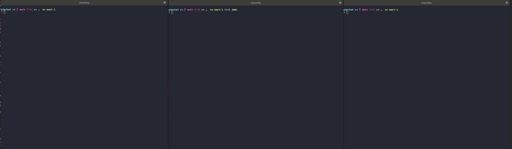

p2pchat

An experiment in C and libevent.

Interactive session:

# Features

[Design](./dev/docs/design.md)

The fundamental design (see link above) is to allow users to connect to each
other using a host:port pair at which point two-way RPC server connections are
opened up.

The features this design should enable are:

- Multiple simultaneous chats - Completed
- Ability to change handles - Completed
- e2e encryption and authentication - Probably just use HTTPS to start
- Queueing messages for when the user comes back online - Skeleton exists

# Bug hunting

Compile-time: clang-tidy, as well as cppcheck

Runtime: valgrind as well as -faddress=sanitize

I ran into a couple of bugs to do with the RPC implementation in libevent. One
of the bugs is here: https://github.com/libevent/libevent/issues/1187
