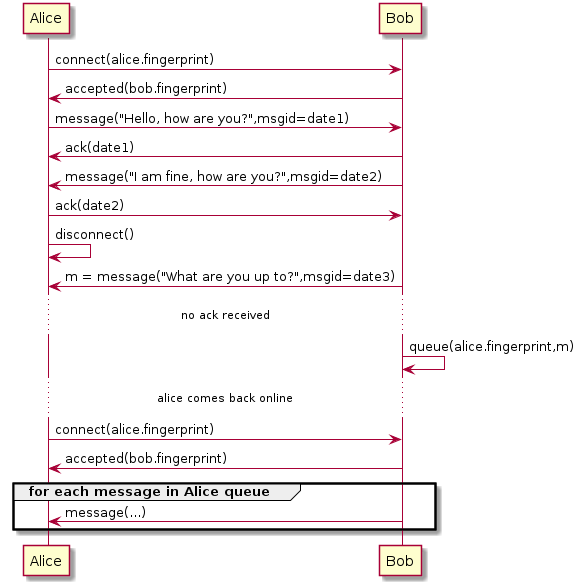
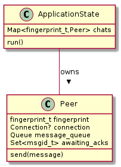
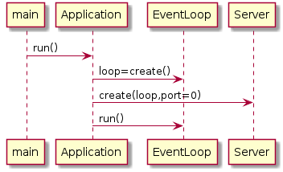
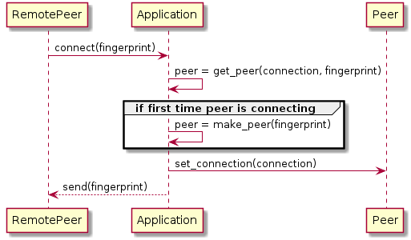

# Table of Contents

1.  [Basic sequence](#org385953b)
2.  [Class diagram](#orge0100f4)
3.  [Application run sequence](#orgd044b15)
4.  [New incoming connection sequence](#orgbba84b0)

# Basic sequence

# Class diagram

# Application run sequence

# New incoming connection sequence

